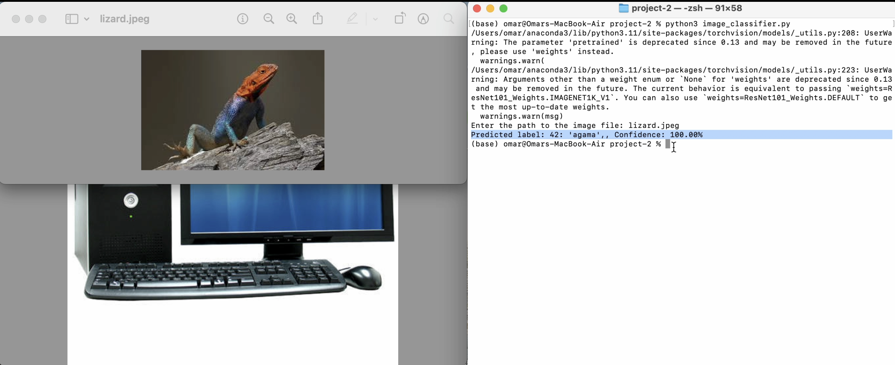
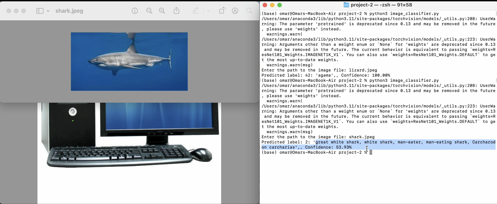
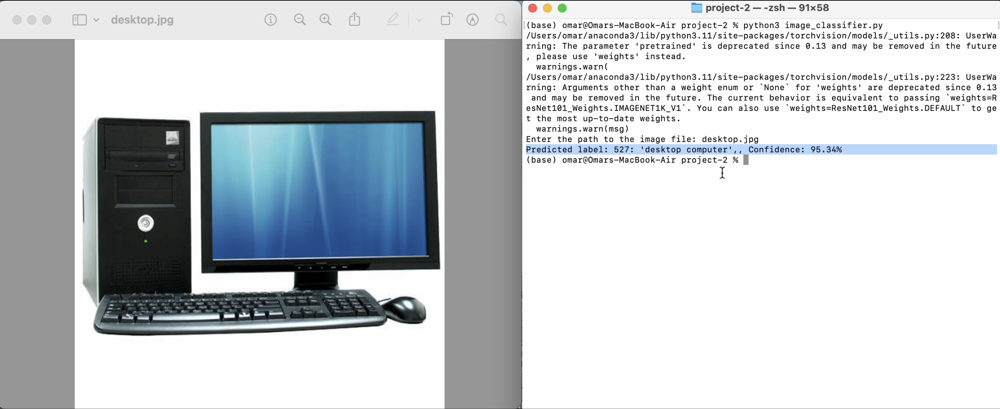

# Image Classification with ResNet

## Demo






## Overview

This project demonstrates how to use the ResNet model for image classification. It allows users to input an image, and the model predicts the object in the image along with its confidence level.

## Requirements

To run this project, you need:

- Python 3.x
- PyTorch
- torchvision
- Pillow

You can install the required libraries using the following command:

```bash
pip install torch torchvision Pillow
